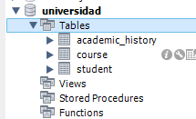
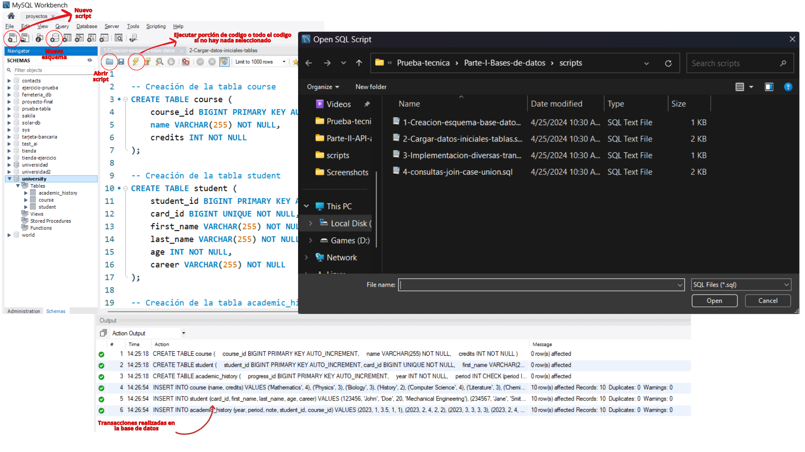
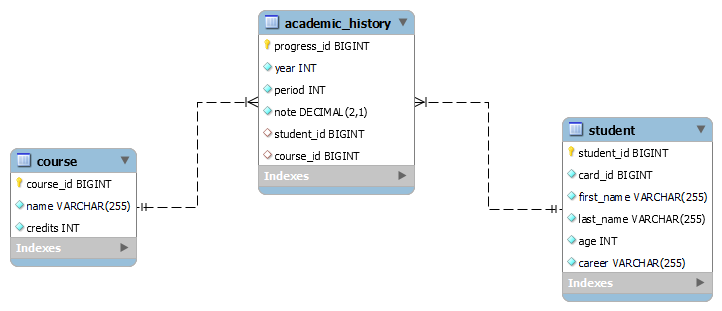
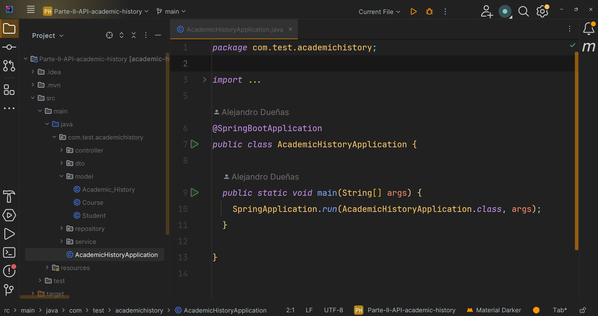
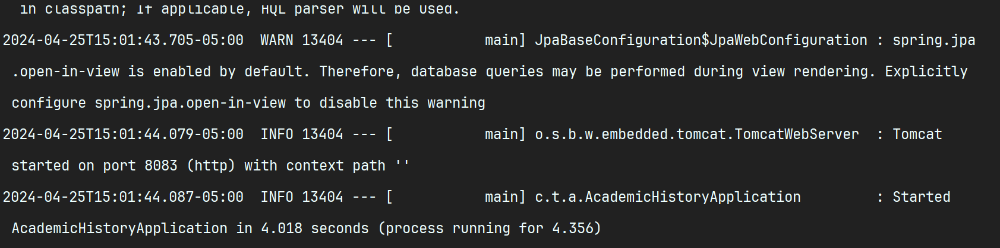
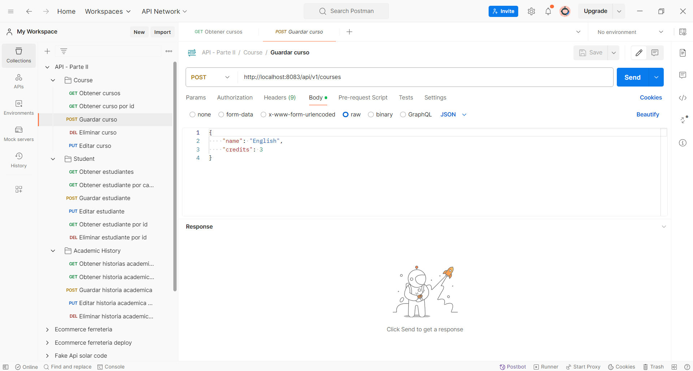
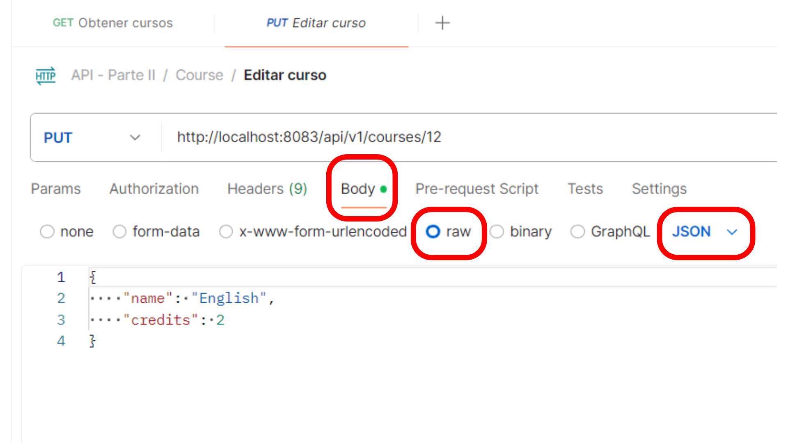
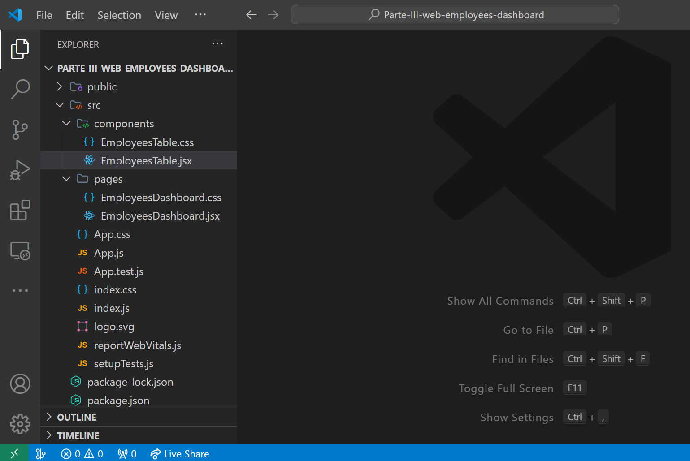
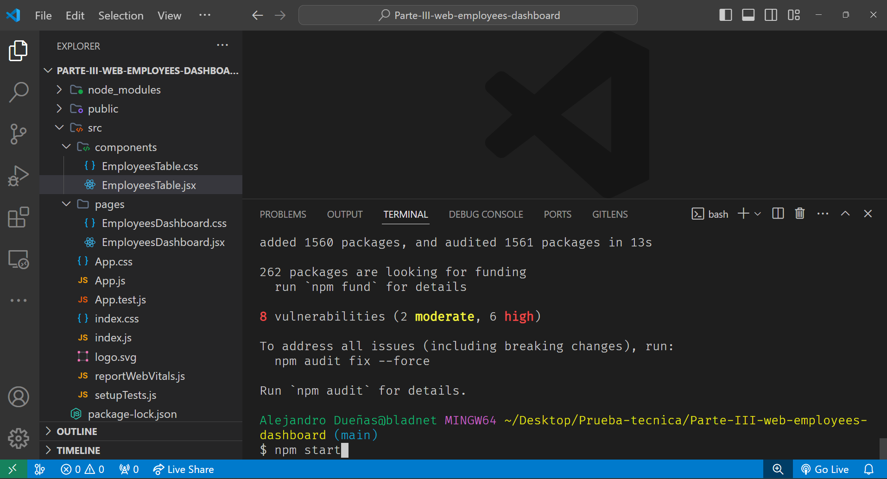
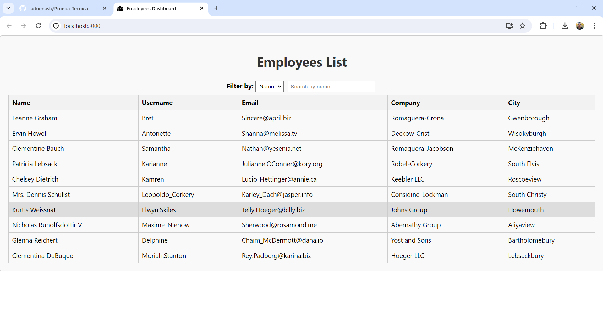

Para ejecutar este proyecto primero clonar este repositorio y abrir la respectiva carpeta, los pasos de cada carpeta se dan a continuación.

# Parte I Bases de datos

Se eligieron tres tablas course, student y academic_history, esta base de datos almacena historias academicas de los estudiantes que incriben materias en un año, el periodo pueder ser 1, 2 o 3. Un estudiante puede inscribir muchos cursos y un curso puede tener muchos estudiantes(relación de muchos a muchos), por lo que se agrega la tabla de historia academica entre ambas normalizando la relación.

En la carpeta scripts hay 4 archivos numerados de 1 a 4. 

- En 1 se crean las tablas
- En 2 se cargan los datos iniciales de cada tabla
- En 3 se realizan distintas consultas basicas(Insert, Select, Update y Delete)
- En 4 se realizan consultas mas complejas usando join, union y case.

Para ejecutar los scripts, primero debe crear un esquema con el nombre **university**:



En la siguiente imagen se observan algunas herramientas y partes de MySQL Workbench:



## Diagrama relacional de la base de datos



# Parte II API - Academic History

Se crea la API para cada tabla, tomando en cuenta sus relaciones, se uso:

- MySQL como gestor de base de datos
- Java 21 como lenguage de programación
- SpringBoot como framework
- IntelliJ IDEA como editor de codigo

Para ejecutar el proyecto abrir en Intellij la carpeta: Parte-II-API-academic-history. Luego abrir el archivo aplication.properties, que se encuentra en la ruta src/main/resources, se va a colocar el **usuario** y **contraseña** que se tenga configurado en MySQL Workbench, el puerto no se modifica se deja en 8083, en MySQL Workbench se crea el esquema **university** para que al ejecutar el proyecto springboot se pueda conectar a este:

## application.properties

```
server.port:8083
spring.datasource.url = jdbc:mysql://127.0.0.1:3306/university
spring.datasource.username=usuario
spring.datasource.password=contresenia
# Show or not log for each sql query
spring.jpa.show-sql=true
# Hibernate ddl auto (create, create-drop, update): with "create-drop" the database
# schema will be automatically created afresh for every start of application
spring.jpa.hibernate.ddl-auto=update
# Allows Hibernate to generate SQL optimized for a particular DBMS
spring.user.datasource.driver-class-name=com.mysql.jdbc.driver
spring.jpa.properties.hibernate.dialect=org.hibernate.dialect.MySQLDialect
spring.jpa.properties.hibernate.format_sql=true
```

Luego identificar la clase main: **AcademicHistoryApplication** y ejecutar en la parte superior el proyecto.



Si todo sale bien en la parte inferior aparecera que el proyecto esta corriendo en el puerto 8083 y la cantidad de segundos que le tomo ejecutar el proyecto:



## Link colección de endpoinst API parte II: 
## https://documenter.getpostman.com/view/23052515/2sA3BrZAjT

Para probar los endpoints de la API, a continuación se provee un link donde esta la documentación de la API en postman, despues dar clic en **Run in Postman** para importar la colección en la aplicación de escritorio, selección My Workspace y luego importar. En postman aparecera lo siguiente:



Para las peticiones tipo **Post** y **Put**, estas llevan un cuerpo en la petición el cual aparece al dar clic en **Body** y luego **Raw**, en formato **JSON**



# Parte III - Aplicación Web

Para ejecutar el proyecto primero abrir la carpeta: **Parte-III-web-employees-dashboard** con visual studio code:



Luego abrir una terminal en visual studio code y ejecutar los siguientes comandos:

```bash
npm install
npm start
```



Luego se abrira una ventana en el navegador donde estara la aplicación web, donde se podran filtrar por Name, Email y City:


